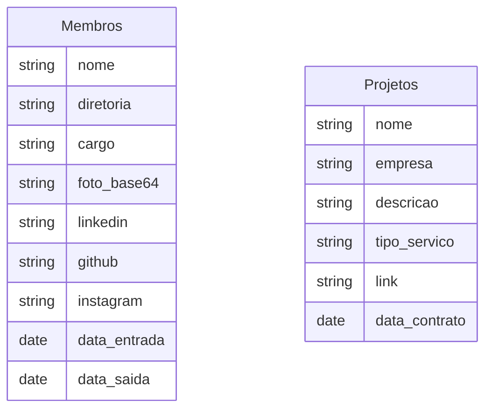

# Inove Jr - Site

[](https://git-scm.com/)
[](https://nodejs.org/)
[](https://nextjs.org/)
[](https://react.dev/)
[](https://tailwindcss.com/)
[](https://ui.shadcn.com/)


[](https://developers.google.com/apps-script?hl=pt-br)
[](https://developers.google.com/sheets?hl=pt-br)

## :bookmark_tabs: Manual

[Git Cheatsheet](https://github.com/d3vlopes/git-ultimate-cheatsheet) - Comandos Git

[Commits semânticos](https://github.com/AdrianaSaty/colinha-commit-semantico) - Padrões de Commits

 [Configurar SSH](https://www.freecodecamp.org/portuguese/news/como-obter-e-configurar-suas-chaves-ssh-do-git-e-do-github/) - Conectar com Github via SSH

## :link: Links

[Figma](https://www.figma.com/file/EDiZutXRORcMXrVqgm40Vv/i9-Website)

## :hammer_and_wrench: Pré Requisitos

- [ ] [Git](https://git-scm.com/downloads)
- [ ] [Node.js](https://nodejs.org/en/download)

## :technologist: Guia de Desenvolvimento

### :sparkles: Iniciar Projeto

#### Clonar Repositório

```bash
git clone git@github.com:inove-jr/i9-website.git
```

#### Instalar Dependências

```bash
npm install
```

#### Executar em desenvolvimento

```bash
npm run dev
```

## :globe_with_meridians: Arquitetura


### :oil_drum: Google Sheets

